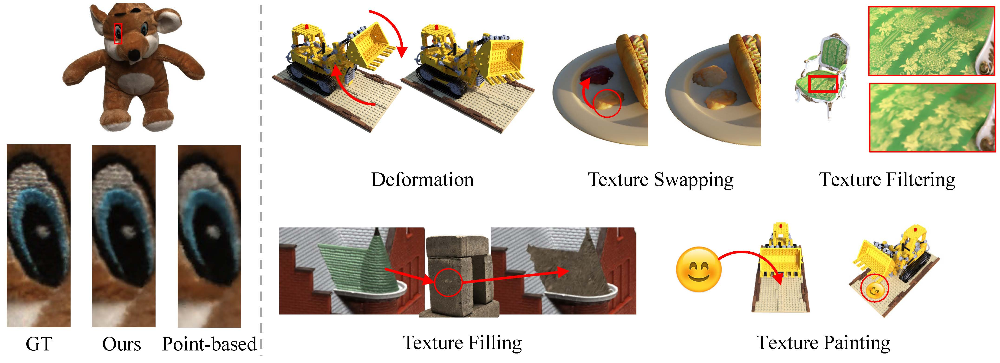

# High-Quality Geometry and Texture Editing of Neural Radiance Field



This repository contains the accompanying code for [High-Quality Geometry and Texture Editing of Neural Radiance Field](paper/uvhnerf_CRC.pdf) presented at [PG2024](https://pg2024.hsu.edu.cn/)

## Abstract

Recent advances in Neural Radiance Field (NeRF) have demonstrated impressive rendering quality reconstructed from input images. However, the density-based radiance field representation introduces entanglement of geometry and texture, limiting the editability. To address this issue, NeuMesh proposed a mesh-based NeRF editing method supporting deformation and texture editing. Still, it fails reconstructing and rendering fine details of input images, and the dependency between rendering scheme
and geometry limits editability for target scenes. In this paper, we propose an intermediate scene representation where a near-surface volume is associated with the guide mesh. Our key idea is separating a given scene into geometry, parameterized texture space, and radiance field. We define a mapping between *xyz*-coordinate space and *uvh*-coordinate system defined by combination of mesh parameterization and the height from mesh surface to efficiently encode the near-surface volume. With
the surface-aligned radiance field defined in the near-surface volume, our method can generate high quality rendering results with high frequency details. Our method also supports various geometry and appearance editing operations while preserving high rendering quality. We demonstrate the performance of our method by comparing it with the state-of-the-art methods both qualitatively and quantitatively and show its applications including shape deformation, texture filling, and texture painting.

## Getting Started


### Environment Setup (Anaconda)
We tested on Anaconda on the docker `pytorch/pytorch:1.13.1-cuda11.6-cudnn8-devel`


```
conda create -n uvhnerf python==3.10.14
conda activate uvhnerf
conda install pytorch==1.12.0 torchvision==0.13.0 torchaudio==0.12.0 cudatoolkit=11.6 -c pytorch -c conda-forge
pip install -r requirements.txt
conda install pytorch-sparse -c pyg
```
### Dataset

[Synthetic-NeRF](https://drive.google.com/drive/folders/128yBriW1IG_3NJ5Rp7APSTZsJqdJdfc1)

[DTU-dataset](https://github.com/Totoro97/NeuS)

### Guide meshes

We extract mesh by using [NeuS2](https://github.com/19reborn/NeuS2)

### Meshes and Configuration

You can get data from [here](https://drive.google.com/file/d/1RYQprUD2PnLjs5JVg1pdlu0K8xPYMP3Q/view?usp=sharing)

## Training

```
CUDA_VISIBLE_DEVICES=0,1 python train.py --config ./configs/lego.txt
```

## Applications

### Deform
```
CUDA_VISIBLE_DEVICES=0,1 python application/app_deform.py --config configs/lego.txt --render_test 1 --ckpt log/nerf_lego/nerf_lego.th --deform_mesh dataset/app_data/deform/lego_deformed.obj --render_only 1
```

### Paint

```
CUDA_VISIBLE_DEVICES=0,1 python application/app_paint.py --config ./configs/lego.txt --paint_texture ./dataset/app_data/paint/emoji.png --ckpt ./log/nerf_lego/nerf_lego.th --render_only 1 --render_test 1
```

### Fill

```
CUDA_VISIBLE_DEVICES=0,1 python application/app_fill.py --config ./configs/dtu24.txt --ckpt ./log/dtu_scan24/dtu_scan24.th --ckpt2 ./log/dtu_scan110/dtu_scan110.th --fill_tex dataset/app_data/fill/result2.png --fill_mask dataset/app_data/fill/mask.png --tex_mask dataset/app_data/fill/mask_edge.png --render_only 1 --render_test 1
```


### Swap
```
CUDA_VISIBLE_DEVICES=0,1 python application/app_swap.py --config ./configs/dtu97.txt --ckpt ./log/dtu_scan97/dtu_scan97.th --fill_tex dataset/app_data/swap/result2.png --tex_mask dataset/app_data/swap/mask.png --render_only 1 --render_test 1
```

### filtering
```
CUDA_VISIBLE_DEVICES=0,1 python application/app_filter.py --config ./configs/dtu24.txt --ckpt ./log/dtu_scan24/dtu_scan24.th --render_only 1 --render_test 1
```

## Useful Links
* [POSTECH CG Lab.](http://cg.postech.ac.kr/)

## Citation
```
Comming Soon
```

## Related projects

**NOTE** : Our implementation is based on the repositories as:
- [TensoRF: Tensorial Radiance Fields](https://github.com/apchenstu/TensoRF)